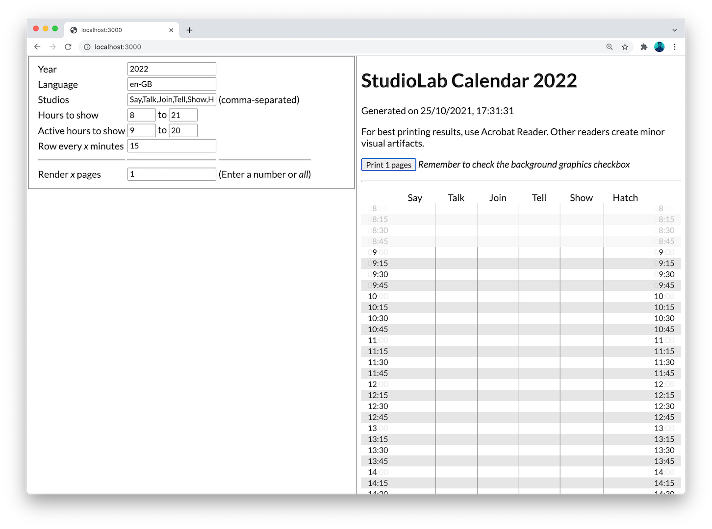
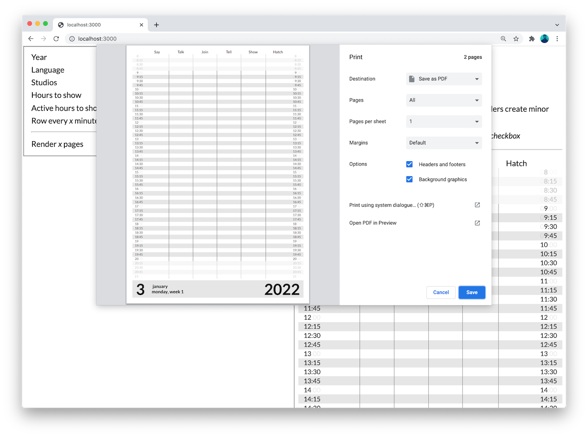

# StudioLab Calendar Creator

This website generates an HTML file that can be saved as a PDF through your
browser and then be printed. Google Chrome is recommended.

## Usage

### Online creator
The easiest way to generate a new calendar is to go to https://studiolab-calendar-generator.netlify.app/ – an online version of this repository, hosted by [Frederik Ueberschär](https://frederik-ueberschaer.de) on Netlify. 

1. Open the [online generator](https://studiolab-calendar-generator.netlify.app/) in Google Chrome.
2. Changes the calendar configuration through the interface on the left side if needed.
3. Change _Render x pages_ to _all_.
4. Click the print button above the calendar.
5. Tick the box for _Background graphics_.
6. Save the PDF and print it through Acrobat.

### Local creator
To run the generator locally, just download the latest build, put it in a static web server (`localhost` is
enough). You can then visit your webserver address and follow the instructions.

> The current stylesheet also uses the font Lato
> ([downloadable from Google Fonts](https://fonts.google.com/specimen/Lato)).
> Make sure it is installed on your system.

## How to build

It's not necessary to build the creator just to use it to create the calendar for the new year, you can download the
latest build instead or use the [online generator](https://studiolab-calendar-generator.netlify.app/).

If you're going to make changes then you will have to build it yourself. Make
sure you have [Node.js](https://nodejs.org/) installed. Download the files, and
run `npm install` on the folder. During development you can use `npm run dev` to
see your changes instantly. To make a finished build, run `npm run build`. The
build will be in the `out` folder.

If changes are made, the online generator will **not** be updated. In that case you will have to create a new Netlify account (it's free, no worries) and host this repository again.

## Architecture

This tool is a [Next.js](https://nextjs.org/) app written in
[TypeScript](https://www.typescriptlang.org/) by [Carlos Precioso](https://precioso.design). You have the main page at
[./src/pages/index.tsx](./src/pages/index.tsx) and the calendar page at
[./src/pages/calendar.tsx](./src/pages/calendar.tsx). It is a regular Next app,
nothing too fancy being used.
